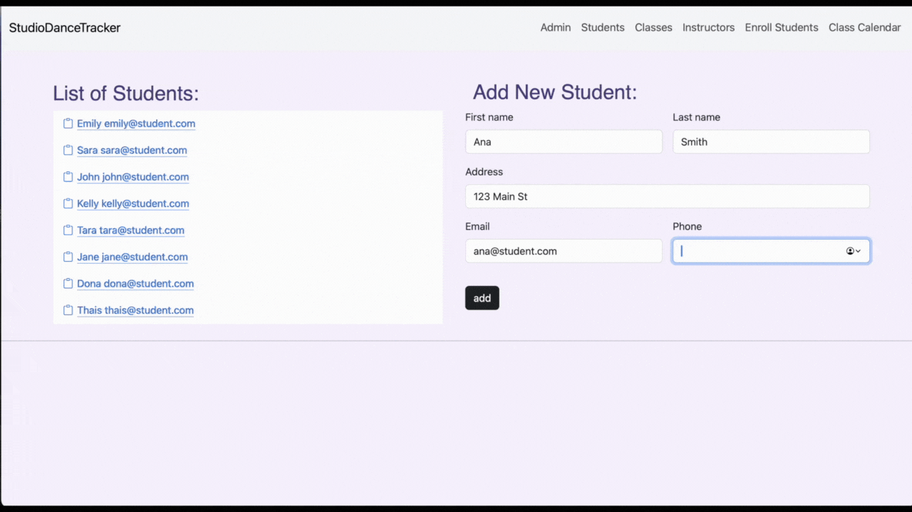
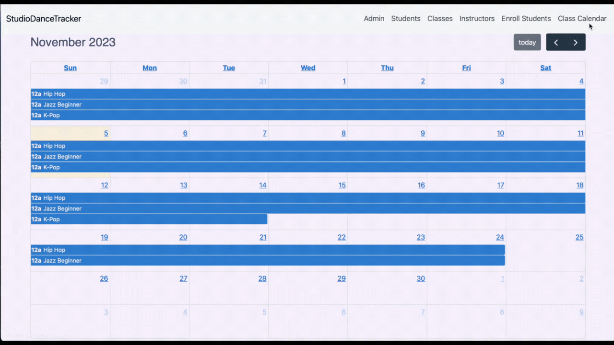

#  StudioDanceTracker

The idea of this project came from a personal motivation to support my sisters, who run a dance studio in Brazil. Understanding their requirement for an effective system to handle classes and student information, the **StudioDanceTracker** was created. The app is an application designed for the management of student data and class administration within a dance studio environment.

# About Me
Julia graduated with a BS in Pharmaceutical Science. Before joining the Hackbright, she worked as Insurance Specialist where she collaborated with a team that launched 2 medications and provided support for healthcare professionals and patients. 

While she enjoyed the healthcare field and helping patients, she was ready for a challenge so she decided to learn how to code and transition into the engineering career. She enjoys that the challenge of learning new things and the problem solving aspect that programming provides. Julia looks forward to apply her developing programming skills contributing meaningfully to innovative projects and furthering her professional development.

# Tech Stack

* Python 
* JavaScript 
* HTML 
* CSS 
* AJAX 
* PostgreSQL 
* Flask 
* Jinja2 
* Bootstrap 
* Flask-Babel

# Features

The backend is built in Python and Flask and it was complemented by a user-friendly front-end interface created with HTML, CSS, and JavaScript and I also utilized bootstrap to enhance the user experience and make each page responsive.

 

The application allows the admin to interact with the database, managed by PostgreSQL. This includes adding, editing, and deleting students, classes, and instructors. Each class entry contains a list of enrolled students along with details about the respective instructors.

I also integrated a feature for generating class statistics, allowing us to analyze student enrollment within specific date ranges. This is done using SQL queries, which instruct the database to retrieve and calculate data giving us the total number of students enrolled during those selected dates.

When enrolling a new student, the web page sends a fetch request to the server upon clicking the 'enroll' button. The server processes the JSON-formatted data from the form and responds. The web page then displays an alert with the status and updates the database as needed.

Additionally, I integrated the Full Calendar JavaScript API to provide a visual representation of the class schedule.

For translation of the app I used the Flask-Babel extension that adds internationalization and localization support. The application automatically detects the locale of the user’s browser, and switches between english and portuguese.

During the project, I adopted an agile approach, closely collaborating with my sisters to gather feedback and ensure the application met their specific needs. I look forward to seeing my sisters using the app in the future.